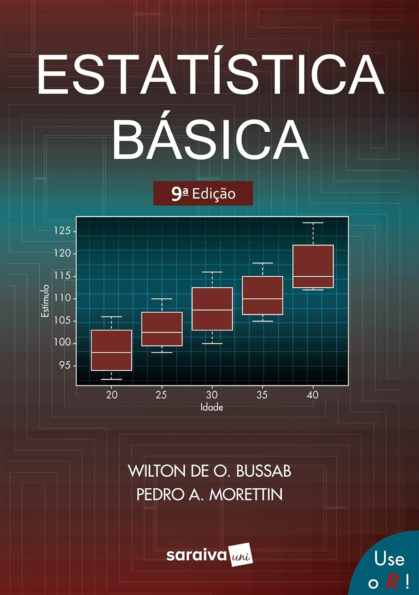
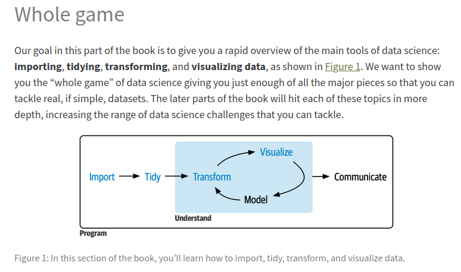

background-image: url(https://upload.wikimedia.org/wikipedia/commons/b/be/Sharingan_triple.svg)

```{r setup, include=FALSE}
options(htmltools.dir.version = FALSE)
library(tidyverse)
```

???

Image credit: [Wikimedia Commons](https://commons.wikimedia.org/wiki/File:Sharingan_triple.svg)

---
background-image: url(https://www.pge.ms.gov.br/wp-content/uploads/2019/07/quem_somos_site-2.png)
background-size: 500px
background-position: 80% 70%
# Conhecendo a turma

- Apresentação de cada um dos alunos;

- Minha apresentação.


---
# Conteúdo programático

Disciplina: **Bioestatística.**

Carga Horária (CH): 60 h.

Créditos: 04.

Semestre: 02.

Ementa: 
- Natureza e Fundamento do Método Estatístico; 
- Técnicas de Amostragem; 
- Distribuição de Frequência; 
- Medidas de Tendência Central; 
- Medidas de Posição (Separatrizes); 
- Medidas de Dispersão (Variabilidade).


---
# Conteúdo programático [...]

Bibliografia Básica:
- MAGURRAN, A.E. 2011. Medindo a Diversidade Biológica. Ed. UFPR, 1a Ed., 261 p.
- GOTELLI, N.J. & Ellison, A.M. 2011. Princípios de Estatística em Ecologia. Ed. Artmed, 1a Ed., 527 p.
- SALVATORI, B. E. Bioestatística. Ed. EPU.
- VIEIRA, S. 2021. Introdução à Bioestatística. Editora Guanabara Koogan Ltda, 6a edição.

Bibliografia Complementar:
- SOUNIS, E. Bioestatística. Ed. McGraw Hill do Brasil Ltda.
- SOUNIS, E. Princípios Fundamentais da Metodologia Estatística Bioestatística. Ed. McGraw Hill do Brasil Ltda.
- SPIEGEL, M. Estatística. Ed. McGraw Hill do Brasil Ltda.

---
# Sugestões de referências adicionais

```{r bussab, echo=FALSE, fig.align="center", out.width="320px"}

```

---
# Sugestões de referências adicionais [...]

```{r, echo=FALSE, fig.align="center", out.width="300px"}

```

---
# Plano de Avaliação

- Frequência nas aulas;

- Participação;

- Exercícios (3x) nas datas prováveis de;
    - Exercício $\#1$: 01/12/2023;
    - Exercício $\#2$: 07/12/2023;
    - Exercício $\#3$: 15/12/2023.

- Atividade coletiva final: Elaboração de um instrumento de coleta de dados. Apresentação em 20/12/2023.

---
class: inverse, center, middle

# Introdução

---
# Dado, Modelo e Resíduo

$$ Dado = Modelo + Resíduo $$
--
```{r dmr, fig.height=4, dev='svg', echo=FALSE}
par(mar = c(4, 4, 1, .1))
plot(cars, pch = 19, col = 'darkgray', las = 1,
     xlab = "Velocidade (mph)", ylab = "Distância (ft)")
```

---
# Dado, Modelo e Resíduo [Modelo ajustado]

$$ Dado = Modelo + Resíduo $$

```{r d-m-r, fig.height=4, dev='svg', echo=FALSE}
fit = lm(dist ~ 1 + speed, data = cars)
par(mar = c(4, 4, 1, .1))
plot(cars, pch = 19, col = 'darkgray', las = 1,
     xlab = "Velocidade (mph)", ylab = "Distância (ft)")
abline(fit, lwd = 3, col = "darkblue")
```

---
# [Continuando...] Atividade: O que é um...

- Questionário? 

- Formulário?

- Há diferença entre eles?


---
# Qual a diferença entre Questionário e Formulário? Quando devo usar cada um?


<iframe width="560" height="315" src="https://www.youtube.com/embed/02FjIDUY9uI?si=vw7T4uYCYwa2Tczf&amp;controls=0" title="YouTube video player" frameborder="0" allow="accelerometer; autoplay; clipboard-write; encrypted-media; gyroscope; picture-in-picture; web-share" allowfullscreen></iframe>

---
# O que é a Estatística?

- Definição de Estatística:

```{r eval=FALSE, tidy=FALSE, include=FALSE}
remotes::install_github("yihui/xaringan")
```

--
É a ciência que permite compreender os conceitos e métodos para coletar, organizar, resumir, analisar e interpretar os **dados** nas tomadas de decisões.<sup>1</sup>

- Planejamento

- Modelos


.footnote[
[1] PASTANA, C.; DE ABREU, J. Introdução à Estatística Educacional. Editora CRV, 2022.

]

---
background-image: url(https://upload.wikimedia.org/wikipedia/commons/thumb/5/50/Calyampudi_Radhakrishna_Rao_at_ISI_Chennai.JPG/800px-Calyampudi_Radhakrishna_Rao_at_ISI_Chennai.JPG)
background-size: 300px
background-position: 50% 70%
# O que é a Estatística?

- [Calyampudi Radhakrishna Rao](https://pt.wikipedia.org/wiki/Calyampudi_Radhakrishna_Rao) (1920 - 2023).

    - Rao, C. R. (1995):

$$\text{Conhecimento útil} = \text{Conhecimento sobre a Incerteza} + \text{Conhecimento Incerto}$$

---
# Dado

- "Definimos dado como uma seqüência de símbolos quantificados ou quantificáveis. Portanto, um texto é um dado. De fato, as letras são símbolos quantificados, já que o alfabeto por si só constitui uma base numérica. Também são dados imagens, sons e animação, pois todos podem ser quantificados a ponto de alguém que entra em contato com eles ter eventualmente dificuldade de distinguir a sua reprodução, a partir da representação quantificada, com o original. É muito importante notar-se que qualquer texto constitui um dado ou uma seqüência de dados, mesmo que ele seja ininteligível para o leitor."<sup>1</sup>

--

- *Dado estatístic*o é toda característica ou informação coletada e registrada
que se refere a uma variável.<sup>2</sup>


.footnote[
[1] [Setzer, V. W. Dado, Informação, Conhecimento e Competência. DataGramaZero - Revista de Ciência da Informação, 1999.](https://www.ime.usp.br/~vwsetzer/dado-info.html)

[2] Vieira, S. 2021. Introdução à Bioestatística.
]


---
# O som como fonte de dados

<iframe width="671" height="377" src="https://eduplay.rnp.br/portal/video/embed/184679" frameborder="0" scrolling="no" allowfullscreen></iframe>

---
class: inverse, middle, center
# O método Estatístico

---
# O método Estatístico

1. Delimitação do problema;

2. Planejamento;

3. Coleta dos dados;

4. Crítica dos dados;

5. Apuração dos dados;

6. Apresentação dos dados;

7. Análise e interpretação dos resultados.

---
# Delimitação do problema

- A primeira etapa do método estatístico consiste em uma delimitação ou definição exata do problema que será investigado. Determinando corretamente o problema que será objeto de análise, além de pesquisar outras investigações desenvolvidas no mesmo campo de conhecimento ou análogos a sua investigação. Essa etapa estabelece o motivo de empregar o método estatístico.


---
# Planejamento

- Após a delimitação do problema, a próxima etapa é o planejamento, que consiste em determinar os procedimentos essenciais para solucionar o problema, especialmente, levantando as informações necessárias sobre o objeto de investigação. Defina o tipo de investigação. Estabeleça o escopo ou aplicação do problema. Setorize a(s) área(s) de conhecimento(s). Obtenha informações amplas, variadas e extensas. Faça resumos, prepare cartões bibliográficos, fichamento de livros, artigos, dissertações e teses. Escreva vários problemas com significados diferentes e selecione o apropriado. Quantifique a necessidade e os custos dos recursos.

--
- Nesta etapa da investigação, a elaboração dos objetivos da investigação deve ser feita de forma clara, pois as demais etapas da investigação serão guiadas pelos objetivos. O objetivo geral da investigação geralmente exige a formulação de objetivos específicos, que são as referências das características que devem ser medidas ou observadas.

--
- Além da elaboração dos objetivos, na fase do planejamento, devemos definir o tipo de pesquisa, realizando um delineamento geral da investigação *quanto aos fins*, *quanto aos meios*, *quanto à unidade de investigação*, *quanto aos instrumentos e técnicas de coleta de dados*, e *quanto ao tipo de análise que será aplicada*.

---
# Planejamento [...]

- **Quanto aos fins**: exploratória, descritiva, explicativa, metodológica, aplicada, intervencionista.

--
- **Quanto aos meios**: pesquisa de campo, pesquisa de laboratório, pesquisa documental, pesquisa bibliográfica, pesquisa experimental, pesquisa *ex post fact* (causa-a-efeito), pesquisa participante, pesquisa-ação, estudo de caso.

--
- **Quanto à unidade de análise**: censitário ou amostral. no levantamento censitário, a contagem das informações abrangendo todo o universo, ou seja, toda a população envolvida. Por outro lado, no lenvamento por amostragem, a contagem é parcial, ou seja, em uma parte significativa da população.

--
- **Quanto às Técnicas e instrumento de Coleta de Dados**: se o levantamento de dados for proveniente de pesquisas de campo, as informações dos fenômenos podem ser obtidas por meio de entrevistas, formulários, questionários ou outras técnicas de aquisição direta de dados.

--
- **Quanto ao tipo de análise**: quantitativa, empregando os procedimentos e testes estatísticos da estatística inferencial, ou qualitativa, empregando a estatística descritiva.

---
# Coleta dos dados

- Posteriormente ao planejamento e especificação da(s) variável(eis) que serão mensuradas, inicia-se a coleta de dados necessários para o detalhamento do fenômeno investigado. A coleta de dados é uma das etapas mais importante no método estatístico, pois, se ela não for bem realizada, comprometerá todas as outras etapas da investigação. 

- A coleta dos dados pode ser *direta* ou *indireta*.


---
# Coleta dos dados [...]

- **Coleta direta**:  é realizada em cima de elementos de registro obrigatório ou feita pelo próprio pesquisador por meio de interrogatórios, questionários, pesquisa, enquete etc. Em relação ao fator tempo, a coleta direta pode ser: *contínua, periódica ou ocasional*. A coleta contínua se configura em uma coleta realizada continuamente, tais como, registro de nascimento, registro de óbitos, frequência dos alunos nas aulas etc. A coleta periódica ocorre em intervalo regular de tempo, tais como, censo populacional, censo escolar, censo previdenciário, avaliações bimestrais etc. Já a coleta ocasional, ocorre em período emergencial, tal como, uma enchente, desabamento, epidemias etc.

---
# Coleta dos dados [...]

- **Coleta indireta**: é deduzida de dados da coleta direta ou do conhecimento dos dados de outras investigações relacionadas. Os dados indiretos são obtidos de outras fontes diretas, como os institutos de pesquisa, bases de dados governamentais ou empresariais, tais como, 
    
    - MEC, 
    
    - INEP, 
    
    - IBGE, 
    
    - DATASUS, 
    
    - BCB, 
    
    - INPI.  


---
# Crítica dos dados

- Após a obtenção dos dados, estes devem ser cuidadosamente analisados, à procura de possíveis erros, falhas ou imperfeições, visando eliminar erros grosseiros. A crítica dos dados pode ser interna ou externa: a primeira visa encontrar erros dos elementos originais dos dados da coleta, já a segunda visa procurar as causas dos erros por parte do informante. Um pesquisador pode encontrar um ou vários dos seguintes elementos que devem ser corrigidos ou tratados, tais como: as respostas são inconsistentes, a escrita não é conclusiva, as respostas estão incompletas, cálculos necessários não foram realizadoos etc.

---
# Apuração dos dados

- Depois de realizada a coleta dos dados, estes devem ser analisados. Dessa forma, é necessário realizar o processamento e a organização por meio de critérios de classificação e a construção de um arquivo de dados. Em geral empregamos planilhas eletrônicas (LibreOffice Calc, Microsoft Office Excel, Google Sheets) ou *software* de estatística (SPSS, Data-Melt, Orange, *R*, Python).

---
# Apresentação dos dados

- Visando às diferentes finalidades da investigação, os dados devem ser apresentados de forma clara e adequada, tornando mais acessível à compreensão e à análise das informações. Algumas *estatísticas* básicas empregadas na descrição dos dados como as médias, mediana, moda, desvio-padrão, variância e proporção (porcentagem) são empregados para expor os resultados dos dados. Porém, usualmente são aplicados para auxiliar na compreensão de tabelas, séries e gráficos estatísticos.


---
# Análise ou interpretação dos dados

- A análise ou interpretação dos dados é o estudo das informações que foram coletadas a fim de encontrar as possíveis soluções ou tornar medidas mais bem organizadas, uma vez que a análise é baseada em dados reais, ou seja, dados estatísticos. A análise é realizada após a estatística descritiva ou inferencial, que fornece elementos para que se possam tirar conclusões ou previsões do fenômeno estatístico investigado. Dessa forma, a análise não pode se limitar a um estudo numérico, é necessário interpretar os valores estatísticos para subsidiar as tomadas de decisões.    

---
class: inverse
# Comparação com o fluxo da Ciência de Dados


---
class: inverse
# Original

```{r, echo=FALSE, fig.align="center", out.width="1000px"}

```


---
class: center, middle, inverse
# [www.r-project.org](www.r-project.org)

---
# Variável estatística

- A partir da perspectiva das definições e conceitos expostos até o momento, percebe-se que os dados estatísticos são obtidos por meio de método que contenham observações ou algum outro meio de mensuração (coleta de dados) de particularidades específicas (respostas, opções) de cada elemento (indivíduo, sujeito, caso) integrante da unidade de análise (população ou amostra). 

--

- Em Estatística, emprega-se constantemente o termo **variável** para representar a(s) características(s) investigada(s) em uma amostra ou população.

---
# Variável estatística [...]

- Variável é o conjunto de possíveis resultados de um fenômeno estatístico. 

- A variável pode ser o próprio fenômeno estatístico ou de características que estão sendo observadas ou mensuradas em cada unidade de análise (população ou amostra). 

- A variável estatística gera apenas um resultado para o elemento observado ou mensurado. 

- As variáveis estatísticas podem classificadas em *quantitativa* ou *qualitativa*.

---
# Variável estatística [...]

- As *variáveis quantitativas* são expressas em números, normalmente acompanhados por unidade de medida. 

- *Exemplos*: 
    - massa corporal, 
    - altura, 
    - número de alunos em uma classe, 
    - salário, 
    - idade, 
    - custo de vendas, 
    - número de filhos.
  
- Elas dividem-se em *discreta* e *contínua.* 

---
# Variável estatística [...]

- A variável quantitativa **discreta** não pode assumir qualquer valor dentro de um intervalo de valores, por exemplo, número de filhos. 

- A variável quantitativa **contínua** assume qualquer valor dentro de um intervalo de valores, massa corporal antes ou depois do almoço. 

- Para a variável quantitativa discreta ocorre uma contagem, já para a variável quantitativa contínua ocorre uma medida.

---
# Variável estatística [...]

- As variáveis qualitativas são expressas por atributos, qualidades ou categorias.

- *Exemplos*: 
    - sexo (masculino ou feminino);
    - cor dos olhos (preto, verde, castanho);
    - raça (preto, pardo, branco, asiático, indígena);
    - escolaridade (ensino fundamental, ensino médio, ensino superior).

- As variáveis qualitativas dividem-se em *nominal* e *ordinal.* Na variável qualitativa **nominal**, os dados são apresentados sem nenhuma ordenação, por exemplo, sexo, fumante ou não fumante, cor dos olhos, enfermo ou saudável. 

- Na variável qualitativa **ordinal**, os dados são apresentados de acordo com um ordem em sua apresentação, por exemplo, estágio da enfermidade (inicial, intermediário, terminal), mês de observação (janeiro,, fevereiro, dezembro), escolaridade (fundamental, médio, superior)


---
# Resumo dos tipos de variáveis

- Escrever na lousa.

---
background-image: url("https://play-lh.googleusercontent.com/bOAxOZiVDnGFWLQoJIfd5NKtjZaHXnGoAc3AjRFymybCM5u19bKayIuQjnX6t8apZUI")
background-size: 250px
background-position: 50% 60%
# Atividade de Revisão

- Demonstração de uso do aplicativo *Plickers*: [www.plickers.com](https://www.plickers.com)

---
# População, amostra e unidade estatística (ou unidade amostral)

- *População estatística ou universo estatístico* é o conjunto de unidades ou elementos portadores de pelo menos uma característica comum a respeito da qual se deseja alcançar informações, e para qual se deseja obter conclusões resultantes da investigação.

- A população pode ser *finita* ou *infinita.*

---
# População

- As *populações finitas* são aquelas limitadas em seu tamanho, ou seja, é possível estimá-lo.

- *Exemplos*:
    - Estudantes de uma sala de aula;
    
    - Número de estudantes inscritos no ENEM no ano de 2021 na cidade de Macapá;
    
    - Número de estudantes cursando a disciplina de Bioestatística na UNIFAP;
    
    - Produtos na prateleira de um supermercado;
    
    - Número de onças pintadas na Estação Ecológica Maracá-Jipioca;

---
# População [...]

- As *populações infinitas* são aquelas cujo número de dados ou objetos é ilimitado ou muito elevado.

- *Exemplos*:
    - Números de estudantes brasileiros enquanto existir o Brasil;
    
    - Número de crianças que nasceram no mundo enquanto existir o planeta Terra;
    
    - Os resultados (cara ou coroa) obtidos em sucessivos lances de uma moeda;
    
    - O conjunto dos números reais;
    
---
# Amostra

- É uma parte significativa e finita da população.

- As amostras são subconjuntos retirados da população da qual se procura obter as informações desejadas na investigação.

--
- *Exemplos*:
    - **População**: Estudantes da Escola X; **Amostra**: Estudantes da turma $5^o$ ano A das escola X.
    
    - **População**: Estudantes inscritos no ENEM no ano de 2021 na cidade de Macapá; **Amostra**: Estudantes faltosos.
    
    - **População**: Estudantes da turma $5^o$ ano A da escola X; **Amostra**: Estudantes aprovados na disciplina de Matemática;
    
    - **População**: Índice da Educação Básica no Brasil - IDEB; **Amostra**: IDEB das cidades do Estado do Amapá.
    
    - **População**: Produtos na prateleira de um supermercado; **Amostra**: Biscoito de castanha
    
---
# Unidade estatística

- É cada um dos elementos que compõem a amostra da população.

- As unidades estatísticas são cada uma das observações de fenômeno individualmente.

--
- *Exemplo*:
    - **População**: Estudantes da Escola X; 
    **Amostra**: Estudantes da turma $5^o$ ano A da escola X; 
    **Unidade Estatística**: Cada aluno da turma $5^o$ ano A da escola X; 
    
    - **População**: Estudantes inscritos no ENEM no ano de 2021 na cidade de Macapá;
    **Amostra**: Estudantes faltosos; 
    **Unidade Estatística**: Cada um dos estudantes faltosos; 

---
# Réplica *vs.* Pseudo-réplica

- Artigo:

    - Hurlbert, S.H. 1984. Pseudoreplication and the design of ecological field experiments. Ecological Monographs, 54: 187-211.

--

- Dica:

    - Sci-Hub: [https://sci-hub.se/](https://sci-hub.se/)


- Repetição é diferente de réplica.

- Independência.

---
# Atividade

- Elabore um exemplo do seu cotidiano exemplificando os conceitos de População, Amostra e Unidade Amostral.

- Entrega pelo *link*: [https://forms.gle/oafKcCBGzmQnyS5B9](https://forms.gle/oafKcCBGzmQnyS5B9)

---
# Exercício $\#1$

- [Leitura, explicação, dúvidas, ...](https://bit.ly/bioestatistica2023)


---
class: middle, center, inverse
# Tabelas

---
background-image: url("figs_aulas/ibge_normas_tabelas.png")
background-size: 260px
background-position: 80% 80%
# Tabelas

- IBGE (1993) – Normas de apresentação tabular.

    - “Forma não discursiva de apresentar informações, das quais o dado numérico se destaca como informação central”.

--

- Elementos básicos:
    - Título;
    - Cabeçalho;
    - Indicador de linha;
    - Célula;
    - Moldura.

--
- Elementos adicionais:
    - Fontes;
    - Notas.


---
# Tabelas

- Desenhar elementos das Tabelas

--

- Exemplo de acesso a Base de Dados oficiais:
    - INEP - Enade: [Microdados Enade](https://www.gov.br/inep/pt-br/acesso-a-informacao/dados-abertos/microdados/enade)

--

- Ir para o livro texto, página 19: *1.3 Normas para a construção de tabelas*.


---
# Distribuição de Frequências

- No livro texto. Página 24 (*1.3.1.1 Tabelas de distribuição de frequências*)

--

- **Tabela 1.3 -** ...

Opinião                  |   Frequência
-----------------------  |  -----------
Ótimo ou bom             |       1.075
Regular                  |       1.506
Péssimo                  |       2.635
Não sabe/não respondeu   |         161
Total                    |       5.377


---
# Frequência relativa

- Equação para o cálculo de frequências:
$$fr = \frac{fa}{n}$$
em que:

$fr$ é a Frequência relativa;

$fa$ é a Frequência absoluta; e,

$n$ é o Tamanho da amostra. $n = \sum_{i=1}^k fa_{i}$, com $k$ sendo o números de classes.

--

- *Outras*: Frequência acumulada, Percentual (%), Frequência percentual acumulada.

---
# Tabelas de contingência

- Quando os dados são apresentados em *tabelas de dupla entrada*.

- Cada entrada para uma das variáveis.

- Também conhecida como *Tabela Cruzada*.

- Livro: *página 26, Exemplo 1.10*.

---
class: middle, center, inverse
background-image: url("figs_aulas/graphs_varios.png")
background-size: 350px
background-position: 50% 90%
# Gráficos

---
# Gráfico de Barras

```{r graf-bar, fig.height=4, dev='svg', echo=FALSE}
iris |> 
  sample_n(size = 0.3*150) |> 
  count(Species) |> 
  ggplot(mapping = aes(x = n, y = Species))+
  geom_bar(stat = "identity", width = 0.5)+
  labs(y = "Espécies", x = "Frequência")
```


---
# Gráfico de Colunas

```{r graf-col, fig.height=4, dev='svg', echo=FALSE}
iris |> 
  sample_n(size = 0.3*150) |> 
  count(Species) |> 
  ggplot(mapping = aes(x = n, y = Species))+
  geom_bar(stat = "identity", width = 0.5)+
  labs(y = "Espécies", x = "Frequência")+
  coord_flip()
```

---
# Gráfico de Setores

```{r graf-set, fig.height=4, dev='svg', echo=FALSE}
iris |> 
  sample_n(size = 0.3*150) |> 
  count(Species) |> 
  ggplot(mapping = aes(x = Species, y = "", fill = Species))+
  geom_bar(stat = "identity", width = 1)+
  labs(x = "", y = "")+
  coord_polar(theta = "x", start = 0)+
  theme_minimal()
```

---
# Dispersão Univariada

```{r graf-dotplot, fig.height=4, dev='svg', echo=FALSE, message=FALSE, warning=FALSE}
iris |> 
  ggplot(mapping = aes(x = Sepal.Length))+
  geom_dotplot(stackdir = "up", color = "black", dotsize = 1)+
  labs(x = "Comprimento da sépala")
```


---
# Histograma

```{r graf-histo, fig.height=4, dev='svg', echo=FALSE, message=FALSE, warning=FALSE}
iris |> 
  ggplot(mapping = aes(x = Sepal.Length))+
  geom_histogram(color = "black")+
  labs(x = "Comprimento da sépala", y = "Frequência")+
  ylim(0,13)
```


---
# Gráfico de Dispersão

```{r graf-dis, fig.height=4, dev='svg', echo=FALSE}
iris |> 
  ggplot(mapping = aes(x = Sepal.Length, y = Sepal.Width))+
  geom_point()+
  labs(x = "Comprimento da sépala", y = "Largura da sépala")
```


---
background-image: url("figs_aulas/cresc_pop_hum.png")
background-size: 600px
background-position: 50% 70%
# Gráfico de linha

- Crescimento Populacional


---
class: middle, center, inverse
# Medidas de Tendência Central

---
# Médias

1. Média Aritmética

$$\bar{x} = \frac{1}{n} \sum_{i=1}^{n}x_i$$
---
# Mediana

---
# Moda


---
class: middle, center, inverse
# Medidas de Dispersão (Variabilidade)

---
# Desvios


---
# Variância e Desvio-padrão


---
class: middle, center, inverse
# Medidas de Posição (Separatrizes)

---
# Quartis, Decis, Percentis


---
class: center, middle, inverse
# Cálculo das Plobabilidades

---
background-image: url("https://cdngo.academiadasapostasbrasil.com/uploads/default/resized/aprenda-a-calcular-as-margens-nas-probabilidades-de-apostas-no-futebol_646_380_HOME_BOX.webp")
background-size: 350px
background-position: 70% 50%
# Definições de Probabilidades

- Definição Clássica;

- Definição Geométrica;

- Definição Frequentista;

- Definição Axiomática;

- Definição Subjetiva;

---
# Probabilidades [...]

- Definição Clássica;

$$P(A) = \frac{\text{Número de elementos em A}}{\text{Número total de elementos em }\Omega}$$

- Definição Geométrica;

$$P(A) = \frac{\text{Comprimento ou Área de A}}{\text{Comprimento ou Área total de }\Omega}$$

---
# Probabilidades [...]

- Definição Frequentista;

$$P(A) = \lim_{n \to \infty} \frac{n(A)}{n(\Omega)}$$
--

- Definição Axiomática (A. N. Kolmogorov ~ 1930);
    - A1: $P(\Omega) = 1$;
    - A2: Para todo subconjunto de A, $P(A) \geq 0$;
    - A3: Para toda sequência $A_1, A_2, ...$, mutuamente exclusivos, temos:

$$P\left(\bigcup_{i=1}^{\infty} A_i \right) = \sum_{i=1}^{\infty} P(A_i)$$

---
class: middle, center, inverse
# Técnicas de Amostragem


---
# Tipos de Amostragem

- Amostragem Probabilística
    - Amostragem Aleatória Simples
    - Amostragem Estratificada
    - Amostragem por Conglomerados ou Clusters
    - Amostragem Sistemática


- Amostragem Não-Probabilística
    - Conveniência
    - Criterial
    - Acidental
    - Bola de neve
    - Por cotas


---
class: middle, center, inverse
# Teste t


---
class: middle, center, inverse
# Extras - Material complementar


---
# Escala Likert


---
background-image: url("figs_aulas/familia.png")
background-size: 210px
background-position: 90% 20%
# Meus contatos

```{r obrigado, echo=FALSE, fig.align="left", out.height="150px"}
knitr::include_graphics("https://media1.giphy.com/media/3oz8xIsloV7zOmt81G/giphy.gif")
```

- *e-mail*: [pgpinheiro@unifap.br](mailto: pgpinheiro@unifap.br)

- *Whatsapp* ou *Telegram*: (96) [9](9)9194-2141

- *Instagram*: [@pgpinheiro2](https://www.instagram.com/pgpinheiro2/)

- *Twitter*: [@pgpinheiro2]()

- [Meu Currículo Lattes do CNPq](http://lattes.cnpq.br/0539600993405515)

- *Endereço Profissional*: UNIFAP, *campus* Marco Zero do Equador - Pró-reitoria de Planejamento.

- Feliz Natal e próspero Ano-Novo!!!
